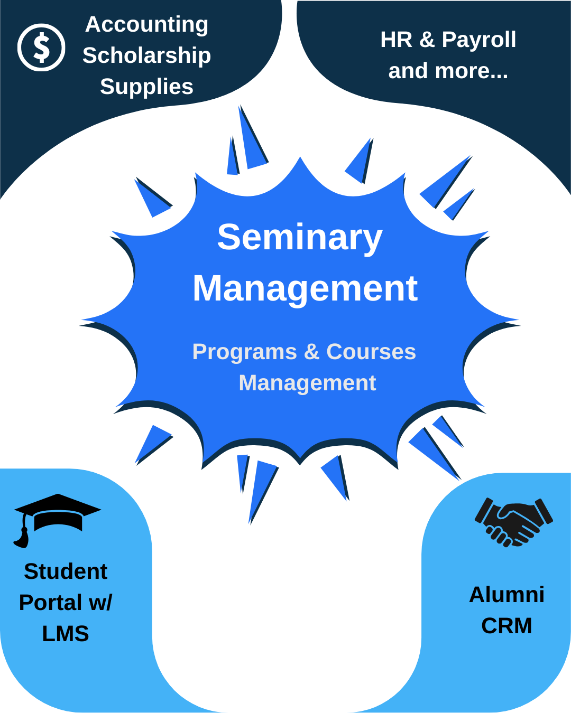

# SeminaryERP Documentation

Seminary ERP is a free open-source software that can grow with your seminary through the power of working together for the glory of God.

Although it is designed to be your one-stop-shop in terms of software, you can also adopt parts of it.

In this introduction, let's understand the BIG picture.

Seminary ERP is developed in an ecossystem of apps under the Frappe Framework. The core of this ecossystem is the excellent ERPNext, the best open-source Enterprise Resource Planning (ERP). With it, you can control payments, receivables, integrated with accounting, bank reconciliation, and much more. If you want to, you can also use their Human Resource Management System (HRMS), to do payroll, have recruitment portal, and much more - things you probably imagined were only accessible for big companies.

Integrated with these is the Seminary ERP app, which consists of

SCHOOL MANAGEMENT SYSTEM + LEARNING MANAGEMENT SYSTEM

The system can be better understood through its two interfaces under the same code.

## Who is this for?

- **Seminary administrators** setting up and running their institution
- **Instructors** managing courses, grading, and discussions
- **Students** navigating enrollment, coursework, and submissions

## Sections

- [Getting Started](getting-started/installation.md) — Install, configure, and run your first academic term
- [Modules](modules/enrollment.md) — Detailed guides for each functional area
- [Administration](administration/user-roles.md) — Roles, permissions, and customization
