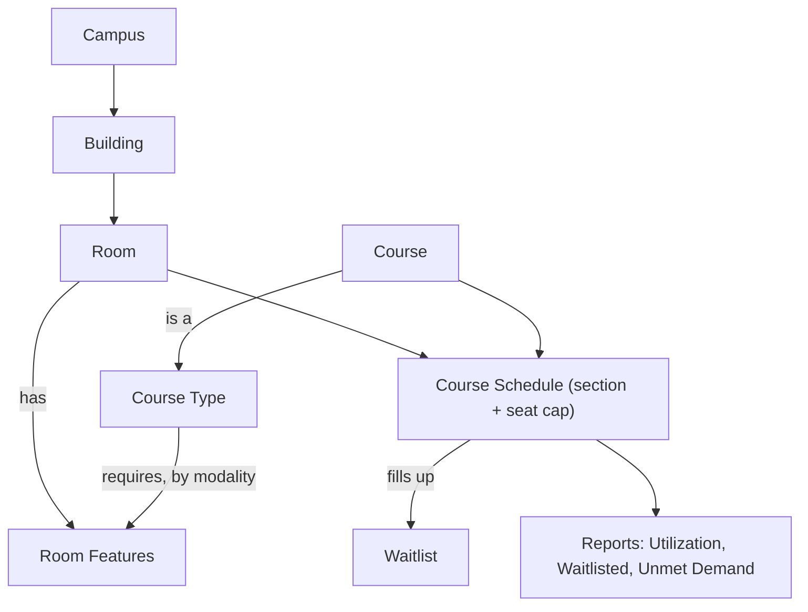

# Rooms & Facilities

Scheduling a term is really a matching problem: the right course, in a room
that's big enough, has what the course needs, and isn't already taken. The
**Rooms & Facilities** tools turn that from guesswork into something you can see
and trust. You describe your spaces once — what each room *has* and how many it
*seats* — describe what each kind of course *needs*, and from then on the system
helps you place sections, keeps a room from being double-booked, manages a
**waitlist** when a section fills, and shows you at a glance which rooms are busy,
which are free, and where demand outran the seats you have.

Everything here is **optional and progressive**. A two-room seminary can ignore
almost all of it and nothing changes. A multi-campus school can model every
building, match features to requirements, and track the equipment in each room
as Assets. You turn on only what helps you.

## Overview

There are a few building blocks. Most seminaries use a subset. Notice that a
room **has** features and a course type **requires** features from the same
list — that shared vocabulary is what lets the system match them.



- A **Room** is your core unit — a space with a name, a number, a **seating
  capacity**, and a list of **features**.
- **Campus** and **Building** are optional containers above the room, for
  multi-site schools and for tidy filtering ("rooms in the Library").
- **Room Features** are a shared vocabulary of what a room offers. The same
  vocabulary describes what a **Course Type** requires, so the two can be matched.
- A **Course Schedule** (a section) is placed in a room and carries a **seat
  cap**; once it's full, students join a **waitlist**.

## The facilities hierarchy (Campus → Building → Room)

You don't have to model buildings or campuses. A room can stand on its own. But
if you have more than one site — or just want "rooms in Chapel Hall" to be a
thing — build the hierarchy top-down.

### Campus

**Desk → Campus → New.** A campus is a physical site of the seminary.

- **Campus Name** — what people call it (*Main Campus*, *Downtown Extension*).
- **Abbreviation** — optional short tag.
- **Timezone** — informational for now. It records the campus's timezone but does
  **not** yet change attendance/chapel check-in windows, which still follow the
  site timezone (see [Attendance](attendance.md)). It's there so the record is
  ready for the future.
- **Active** — untick to retire a campus without deleting its history.

### Building

**Desk → Building → New.** A building belongs to a campus.

- **Building Name** — *Library*, *Chapel Hall*. The same name may repeat across
  campuses.
- **Campus** — which campus it sits on.
- **Accessible** — a quick flag for step-free access.

### Room

**Desk → Room → New.** Beyond the basics (name, number, **seating capacity**,
accessible), a room can name its **Building** — its **Campus** then fills in
automatically — and list its **Room Features**. Capacity is the number that drives
seat caps and the "is this room big enough?" checks, so it's worth keeping
accurate.

## What a room has, what a course needs

This is the pairing that makes smart scheduling possible: describe rooms and
courses in the *same words*, and the system can tell you when a room is a poor
fit.

### Room Features — what a room has

A **Room Feature** (Desk → Room Feature) is one capability a room can offer:
*Projector*, *Sound System*, *Piano*, *Whiteboard*, *Wheelchair Accessible*, and
so on. Each carries a **Category** (AV Equipment, Musical, Room Configuration,
Specialized) for tidy grouping. A starter set is provided; add your own freely.

On each **Room**, list the features it actually has in the **Room Features**
table. That's the room's profile.

> **Accessibility is a feature too.** Marking a room *Wheelchair Accessible* as a
> feature (not just the old yes/no flag) lets a course *require* it — see below.

### Course Type — what a course needs

A **Course Type** (Desk → Course Type) groups courses by what they require of a
room. Inside it, the **Requirements** table lists, per **modality**, the
**Room Features** that modality needs:

| Modality | Required Room Feature |
| --- | --- |
| All | Projector |
| Presential | Whiteboard |
| Hybrid | Sound System |

*All* applies to every modality; the specific rows add to it. So a Presential
section of this course type needs a Projector **and** a Whiteboard.

On each **Course**, set its **Course Type**. From then on, every section of that
course knows what it needs — and the room picker uses it.

If a course has no Course Type, or a Course Type has no requirements, nothing is
lost — the matching simply stays quiet. You add requirements only where they help.

## Placing a section in a room

When you set the **Room** on a Course Schedule, the system works for you in three
ways.

### A best-fit room picker

The Room dropdown is **ordered to put the best fit first** and annotates each
choice, so you're not picking blind. A row reads something like:

```
Chapel Hall 101 · cap 60 · ✓ fits · free
Room 204       · cap 30 · ✗ missing 1 · busy
```

- **cap** — the room's seating capacity.
- **✓ fits / ✗ missing N** — whether the room has the features this course's
  type requires for this modality.
- **free / busy** — whether the room is already booked during this section's
  meeting times.

Rooms that are free, fit, and larger float to the top. Nothing is hidden — you
can still pick any room — but the good choices are obvious.

### Warnings and hard stops

On save, the system distinguishes "you may want to know" from "this can't be":

- **Missing a required feature → a warning.** You're told the room lacks
  something the course type asked for (e.g. "missing Projector"), but the save
  goes through. Sometimes a substitute is fine, and you're in charge.
- **Double-booking → blocked.** If the room is already booked by another section
  at an overlapping time on a shared date, the save is stopped, naming the
  conflict. Back-to-back classes (one ends as the next begins) are fine.
- **Room too small → blocked.** You can't move a section into a room that seats
  fewer than it already has enrolled.

### Changing rooms, on the record

Use the **Change Room** button on a Course Schedule to move a section. It asks
for the new room **and a reason**, and records both in the section's **Room
Change Log** with who changed it and when — so a mid-term shuffle ("projector
broke in 204") leaves a trail. Moving a section to a **bigger** room also lets
the waitlist promote into the new seats automatically.

## Capacity and the waitlist

This is where rooms stop being decoration and start protecting you from
over-enrollment.

### The seat cap

Every Course Schedule has a **Max Enrollment**. When you choose a room, it
**defaults from that room's seating capacity** — but you can override it (a
seminar capped at 12 in a 30-seat room) or clear it (no cap). Leave it blank and
the section is uncapped, and the waitlist stays dormant.

Alongside it, the section shows three live numbers:

- **Seats Used** — students who hold a seat (enrolled, plus those who've been
  invoiced and are paying).
- **Registrations** — total demand, including drafts and the waitlist.
- **Waitlist** — how many are queued.

### Joining the waitlist

When a section is full, a student who enrolls is placed on the **waitlist**
instead of taking a seat — they see a **Waitlisted** status and their **position**
(#1, #2…). No invoice is raised for a waitlisted student; they're holding a place
in line, not a seat.

### Automatic promotion

The moment a seat frees up — someone withdraws, an unpaid seat is released, you
raise the cap, or you move the section to a bigger room — the **next student on
the waitlist is promoted automatically**. They (and you, the registrar) are
notified. For a paid course, promotion raises their invoice; for a free one, they
go straight in. Promotion is first-come, first-served by when they joined.

### When the line doesn't clear: "Unseated"

If enrollment closes while students are still waiting, those students move to a
terminal **Unseated** status. That's not a withdrawal — they were never seated —
it's simply the honest record that they wanted in and the room couldn't hold
them. It powers the **Unmet Demand** report, your evidence for "we need a bigger
room or a second section."

> **Why this matters.** Before, a full course either silently overfilled or
> turned students away with no trace. Now capacity is respected, the queue is
> fair and automatic, and every student who couldn't get a seat is counted.

## Seeing the whole term: reports

Three Desk reports (each filterable by Academic Term) turn all of this into a
registrar's-eye view.

- **Room Utilization** — every room with the sections scheduled in it, their
  days and times, and seats vs. capacity — **plus rooms with no sections**, so
  empty spaces are visible. This is your tool for shuffling sections around when
  one room is jammed and another sits idle.
- **Waitlisted Sections** — every section that currently has a waitlist, with its
  cap, seats used, waitlist length, and total demand. Your shortlist for "where
  do we need a bigger room or another section?"
- **Unmet Demand** — students who waitlisted but never got a seat (Unseated),
  grouped by section. The hard number behind a request for more space.

## Tracking equipment: Asset integration

If your seminary tracks **Assets** (ERPNext's fixed-asset register — the actual
projector unit, the piano, the lab kit), every asset must live in a *location*.
To make that effortless, the seminary **mirrors your Campus → Building → Room
hierarchy into the asset Location tree automatically**. Create a room, and a
matching location appears under its building and campus; an asset can then be
placed "in" that room with no parallel bookkeeping.

This is controlled in **Seminary Settings → Facilities & Assets**:

- **Sync rooms to Asset Locations** — on by default. If you don't track assets,
  turn it off and no locations are created. Turn it back on and existing
  campuses, buildings, and rooms are backfilled.
- **Root Asset Location** — optional. Where your spaces hang in the location
  tree. Leave it blank to use an auto-created "Seminary Locations" root, or point
  it at a location you already use.

The mirror is one-way (your rooms drive the locations, never the reverse), and it
never deletes a location that still holds an asset. A nice side effect: because a
room's *features* and its *assets* now share a place, you can reconcile "rooms
that should have a projector" with "rooms that actually have one."

## Worked examples

### Example 1 — A music course that needs a piano

**Goal:** every section of *Hymnody* should be placed in a room with a piano, and
you want to be warned if it isn't.

1. **Make the feature.** Desk → Room Feature → confirm *Piano* exists (Category
   *Musical*).
2. **Tag the rooms.** On each room that has one, add *Piano* to its Room Features.
3. **Describe the need.** Desk → Course Type → *Music* → Requirements: modality
   *All* → *Piano*. Set the *Hymnody* course's **Course Type** to *Music*.
4. **Schedule it.** When you set the room on a Hymnody section, the picker shows
   *✓ fits* for piano rooms and *✗ missing 1* for the rest. Pick a non-piano room
   and you'll get a dismissible warning — your call.

### Example 2 — A popular elective fills up

**Goal:** *Intro to Counseling* has 25 seats; you expect more interest.

1. **Cap it.** On the section, the Room is a 25-seat room, so **Max Enrollment**
   defaults to 25.
2. **It fills.** The 26th student enrolls and is **Waitlisted #1**; the 27th is
   **#2**. No invoices are raised for them.
3. **A seat opens.** A seated student withdraws. **#1 is promoted
   automatically**, invoiced (it's a paid course), and both they and you are
   notified. **#2** becomes **#1**.
4. **You decide to grow it.** You move the section to a 40-seat room with
   **Change Room** (reason: "moved to Room 300 for capacity"). The waitlist
   promotes into the new seats until it clears or the room is full again.
5. **The term starts.** Anyone still waiting becomes **Unseated** and shows up in
   **Unmet Demand** — your case for a second section next year.

### Example 3 — A second campus opens

**Goal:** model a new Downtown campus and track its equipment.

1. Create **Campus** *Downtown*, then **Building** *Annex* (campus *Downtown*),
   then **Rooms** with Building *Annex* — each room's Campus fills in as
   *Downtown*.
2. With **Sync rooms to Asset Locations** on, matching locations appear under
   *Downtown → Annex* automatically.
3. Register the Annex's projectors and pianos as **Assets**, placing each in its
   room's location. Now equipment, features, and scheduling all line up.

## Day-to-day for the registrar

- **Add a room.** Desk → Room → New. Set capacity and features; optionally a
  building. That's enough to start scheduling against it.
- **Schedule a section.** On the Course Schedule, pick the **Room** (use the
  ranked picker), confirm **Max Enrollment**, and save. Heed warnings; conflicts
  and oversize moves are blocked.
- **Find a free room at a given time.** Open **Room Utilization** for the term and
  scan for rooms with gaps (or no sections at all).
- **Manage demand.** Check **Waitlisted Sections** during registration; when a
  section is over-subscribed, raise the cap, move it to a bigger room, or open a
  new section. The waitlist promotes itself as seats appear.
- **Move a section.** Use **Change Room** (with a reason) — never just blank the
  field — so the move is logged.
- **Justify more space.** Bring **Unmet Demand** to the planning conversation.

## Quick reference

| If you want to... | Do this |
| --- | --- |
| Add a space | Create a Room (set seating capacity) |
| Group rooms by site | Create Campus and Building, then set the room's Building |
| Say what a room offers | Add Room Features to the room |
| Say what a course needs | Set the Course's Course Type; add Requirements (modality → feature) |
| Place a section | Set the Room on the Course Schedule (the picker ranks best-fit first) |
| Cap a section | Set Max Enrollment (defaults from the room; blank = uncapped) |
| Avoid double-booking | Nothing — overlapping bookings of the same room are blocked on save |
| Move a section, on the record | Use **Change Room** and give a reason |
| Let a full course queue students | Just enroll past the cap — extras are Waitlisted and promoted automatically |
| See who was turned away | Run the **Unmet Demand** report |
| Find free vs. busy rooms | Run the **Room Utilization** report |
| Track equipment in rooms | Keep **Sync rooms to Asset Locations** on; register Assets in each room's location |
| Skip all of this | Leave Course Types, features, and caps empty; turn the sync setting off |

## Related

- [Enrollment](enrollment.md) — how students enroll, and how waitlist promotion
  and unpaid-seat release fit the enrollment lifecycle.
- [Attendance](attendance.md) — check-in time windows and the site-timezone note
  behind the (informational) campus timezone.
- [User Roles](../administration/user-roles.md) — who can manage rooms, course
  types, and schedules.
